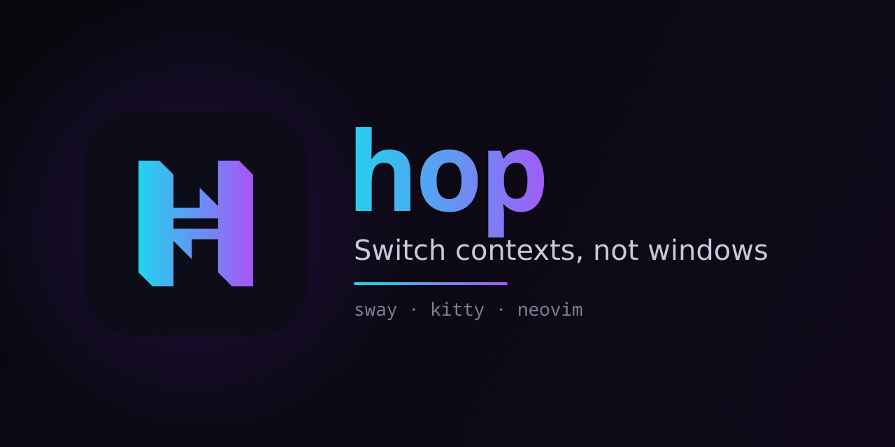

hop is a context switcher for terminal work. hop facilitates working on multiple things at the same time.

Each stream of work gets its own **hop session** - a dedicated Sway workspace identified by its working directory, holding the editor, terminals, and browser open for it. Moving between sessions is a single jump. hop also takes care of session lifecycle (prepare, teardown).

A hop session is conceptually similar to a tmux session, except session/window management is delegated to an actual system window manager (and optionally an app launcher). That means:

- **Single window manager** - sway's normal shortcuts apply directly, no second layered keymap, no prefix key.
- **GUI apps are part of the session** - browser, etc., not just terminals.
- **No multiplexer in the way** - native terminal features work without lossy passthrough; system clipboard and scrollback are the real ones, not a copy-mode buffer.

hop is built on top of [Sway](https://swaywm.org/) window manager and [Kitty](https://sw.kovidgoyal.net/kitty/) terminal emulator and a TUI editor ([Neovim](https://neovim.io/) by default). Optional [Vicinae](https://www.vicinae.com/) launcher integration turns hop into a true "zero new key bindings" solution.

## Features

- **Session terminals start in the session directory** - spawn a shell anywhere in a session and it's already `cd`-ed into the session root.
- **Dedicated session browser** - to keep project specific pages close to home.
- **Open from terminal output** - bundled Kitty kitten picks file paths and URLs from visible output and dispatches them to the session's editor or browser.
- **Pluggable backends** - shells and editor can run on the host, inside a docker container, or anywhere describable as a chain of commands - without changing how you drive the session.
- **Remote sessions over ssh** - run any of those backends on a remote machine with `hop ssh`; the same project config drives it whether you're local or remote.
- **Layouts** - configure certain projects to start with extra windows (e.g. "server" or "console" for rails).
- **Vicinae-driven workflow** - sessions, windows, and switches surface as direct entries in the launcher's main search; a single `exec hopd` line in the Sway config wires it up.
- **Scriptable** - everything Vicinae dispatches to is also a `hop` CLI subcommand.

## Requirements

- Linux
- Python
- [Sway](https://swaywm.org/) window manager
- [Kitty](https://sw.kovidgoyal.net/kitty/) terminal emulator
- A TUI editor ([Neovim](https://neovim.io/) by default)

Optionally:

- [Vicinae](https://www.vicinae.com/) launcher

## Installation

```bash
uv tool install git+https://github.com/artemave/hop
```

Or with pipx:

```bash
pipx install git+https://github.com/artemave/hop
```

### Upgrading

After re-running `uv tool install --reinstall .` (or `pipx upgrade hop`), the running `hopd` is still the old version. Restart it to apply the upgrade:

```bash
hopd --restart
```

## Usage

Some of the hop's features rely on a `hopd` daemon. Add this to your Sway config to ensure it's running:

```conf
exec hopd
```

Day-to-day, [Vicinae](https://www.vicinae.com/) is the primary surface. What you see when you type `hop` in Vicinae's main search depends on where you are:

- **On a hop session's workspace** (`p:<session>`): one entry per declared window - `Hop editor`, `Hop browser`, `Hop shell`, etc. Plus `Hop kill` for the focused session and `Hop switch to <other-session>` for every other live session.
- **Off any hop workspace**: only `Hop switch to <session>` per live session - no `Hop kill`, no per-window entries to clutter unrelated workspaces.
- **Always**: `Hop create session` - falls through to a second Vicinae search over directories under `$HOME` (skips dot-dirs and common build noise like `node_modules`, `target`, `dist`). Picking a directory creates a fresh session for it, or - if it's already the root of a hop session - switches to it.

Two complementary surfaces are described in their own sections below:

- [Sway shortcuts](#sway-shortcuts) - a key for "new shell in this session", faster than going through Vicinae for the most common action.
- [Open visible-output targets from Kitty](#open-visible-output-targets-from-kitty) - a Kitty kitten that picks file paths and URLs from terminal output and routes them to the session's editor or browser.

Everything Vicinae's entries dispatch to is also reachable directly via the `hop` CLI (`hop`, `hop switch <name>`, `hop move <name>`, `hop term --role <name>`, `hop open <target>`, `hop browser`, `hop kill`) - useful for scripting and automation.

## Sway shortcuts

Bind this helper script in your Sway config to spawn a new shell in the focused hop session (or a plain kitty when not on a hop workspace). Run `hop path sway/term-or-kitty` once and paste its output - using `$(...)` here would re-run hop on every keypress:

```conf
bindsym $mod+Return exec /printed/by/hop/path
```

## Open visible-output targets from Kitty

Add a Kitty mapping that runs the `hints` kitten with hop's custom processor:

Kitty's config doesn't run a shell, so the path has to be substituted by hand. Run `hop path kitten/hints` and paste its output:

```conf
map ctrl+shift+o kitten hints --customize-processing /printed/by/hop/path
```

The picker scans visible terminal output and dispatches supported selections to the session editor or browser:

- `app/models/user.rb`
- `app/models/user.rb:42`
- `b/app/models/user.rb`
- `https://example.com`
- `Processing UsersController#index`

File-shaped tokens that don't exist (per the focused session's backend) are not highlighted. The kitten asks `hop.focused.paths_exist`, which queries the focused session's backend through `noninteractive_prefix` - so paths inside a devcontainer or remote ssh host are checked in the right namespace.

### Binary files open on the host

Choosing a `.png` in the open-selection kitten opens the file with your host's `xdg-open` instead of nvim - so PNGs land in your image viewer, PDFs in your reader, archives in your file manager, all using the tools you've already configured on your machine. This seamlessly works over ssh as well.

## Configuration

A hop config has three named sections plus one scalar setting, all optional:

- `[backends.<name>]` - backend lifecycle (`prepare` / `teardown` / translate helpers) plus two prefixes: `interactive_prefix` for interactive launches and `noninteractive_prefix` for hop's piped queries (file-existence checks).
- `[layouts.<name>]` - a named layout with one required `activate` shell-snippet probe and a list of windows that come up together when the probe matches.
- `[windows.<role>]` - top-level windows (always active unless `activate = "false"`).
- `workspace_layout = "<mode>"` - sway workspace layout applied at first session entry. One of `splith`, `splitv`, `stacking`, `tabbed`.
- `debug_log = true` - opt-in diagnostic log; see [Troubleshooting](#troubleshooting).

Configs live in `~/.config/hop/config.toml` or a project's `.hop.toml`.

## Session backends

A session has a **backend** that decides what kind of environment its windows run in. The default is **host**. Other backends - docker container (devcontainer) or anything else describable as a chain of commands - are configured as named entries in the config file. Running a backend on a *remote* machine is a separate axis - the ssh transport (`hop ssh`, see [Remote sessions over ssh](#remote-sessions-over-ssh)) - not a backend of its own.

Note, that nvim runs on the backend, not on the host (unless backend is the host).

**System clipboard on non-host backends.** With nvim on a remote host or inside a container there's no local display for `wl-copy`/`xclip` to reach, so the system clipboard has to go through OSC 52, which Kitty relays back to your real clipboard over the terminal. Point nvim's clipboard provider at OSC 52 whenever no display is present:

```vim
if empty($WAYLAND_DISPLAY) && empty($DISPLAY)
  let g:clipboard = 'osc52'
endif
```

Naming the provider explicitly is required when `'clipboard'` is set to `unnamed`/`unnamedplus` - that otherwise suppresses nvim's automatic OSC 52 detection, leaving the clipboard with no provider at all.

Copy works with that alone. **Paste** (`"+p`) issues an OSC 52 *read*, which Kitty gates behind `clipboard_control` - the default `read-clipboard-ask` prompts on every paste. Add `read-clipboard` to your host `kitty.conf` to silence it:

```conf
clipboard_control write-clipboard write-primary read-clipboard read-primary
```

Trade-off: any program in any Kitty window can then read the system clipboard.

### Remote sessions over ssh

Run any project's session on a remote machine with **`hop ssh <host>`**: it sets up the ssh transport (ControlMaster, the reverse-forwarded bridge socket, the installed shim) and drops you into a remote shell, where `cd <project> && hop` starts the session there. The project's own `.hop.toml` drives it - the *same* recipe runs a container locally or on the remote, with no ssh in the config and no local stub directory. hop wraps each command in the ssh transport for you, and `{host}` resolves to the remote (or `localhost` locally) for host-dependent values like `LOCAL_HOSTNAME={host}`. See **[docs/hop-ssh.md](docs/hop-ssh.md)** for the usage guide (and troubleshooting, e.g. raising sshd `MaxSessions`).

### Auto-detection

When you enter a session (bare `hop`), hop walks the configured backends in declaration order and runs each backend's `activate` probe in the session root. The first one that exits 0 wins. If none succeed, the session falls back to **host**. The chosen backend is persisted and reused for all subsequent commands against that session.

### Backend example

```toml
[backends.devcontainer]
activate              = "test -f docker-compose.dev.yml"
prepare               = [
  "podman-compose -f docker-compose.dev.yml --in-pod=false up -d devcontainer",
  """curl -fsSL https://github.com/kovidgoyal/kitty/releases/latest/download/kitten-linux-amd64 \\
    | podman-compose -f docker-compose.dev.yml exec -T devcontainer \\
        sudo install -m 755 /dev/stdin /usr/local/bin/kitten""",
]
teardown              = "podman-compose -f docker-compose.dev.yml down"
port_translate        = """
  podman ps -q \\
    --filter label=io.podman.compose.project=$(basename {session_root}) \\
    --filter label=io.podman.compose.service=devcontainer \\
    | head -1 \\
    | xargs -r -I@ podman port @ {port} \\
    | cut -d: -f2
"""
interactive_prefix    = "podman-compose -f docker-compose.dev.yml exec devcontainer"
noninteractive_prefix = "podman-compose -f docker-compose.dev.yml exec -T devcontainer"
```

Each lifecycle / translate field is **either a single string or a list of strings**. Single-string values run as one `sh -c` invocation; list values run each element as its own `sh -c` invocation in declaration order. For `prepare` and `teardown` the sequence aborts on the first non-zero exit (the popup's held shell shows the failing step). For `port_translate` / `host_translate` the *last* element's stripped stdout is the translated value (earlier elements run for their side effects). Use TOML triple-quoted strings (`"""…"""`) for multi-line pipelines inside any element. Placeholder values are shell-quoted before insertion, so paths with spaces substitute safely. `interactive_prefix` and `noninteractive_prefix` stay string-only - they wrap, they don't sequence.

Backend fields:

- `activate` (optional) - auto-detect probe. Backends without `activate` can only be picked by name.
- `prepare` (optional, string or list) - command(s) run once at session creation, before launching kitty. Should be idempotent. List form runs steps sequentially and aborts on the first failure.
- `teardown` (optional, string or list) - command(s) run at `hop kill` after closing windows.
- `port_translate` (optional, string or list) - command(s) run lazily by the `kitten/hints` kitten when it dispatches a `localhost` / `127.0.0.1` / `0.0.0.0` URL. The last step's stdout is the host-reachable port that should replace the URL's port. `{port}` is substituted with the URL's original port.
- `host_translate` (optional, string or list) - command(s) run lazily for the same set of localhost URLs. The last step's stdout is the hostname that should replace `localhost` / `127.0.0.1` / `0.0.0.0` in the URL.
- `interactive_prefix` (required) - shell snippet prepended to every window command launched in this backend's environment. Empty for the implicit host backend.
- `noninteractive_prefix` (required) - prefix hop uses for non-interactive backend operations like file-existence checks. Backends that allocate a TTY by default (podman-compose exec) must set the no-TTY variant (e.g. `... exec -T devcontainer`); backends that don't (ssh) pass the same string as `interactive_prefix`. The implicit `host` backend ships with both prefixes set to `""` (empty).

Supported placeholders: `{session_root}` (anywhere), and `{port}` (in `port_translate` / `host_translate` only).

The name `host` is reserved for the implicit fallback.

### Layouts and windows

Per-role launch commands live outside the backend, in `[layouts.<name>]` or `[windows.<role>]` tables:

```toml
[layouts.rails]
activate = "test -f bin/rails"

[layouts.rails.windows.server]
command = "bin/dev"

[layouts.rails.windows.console]
command  = "bin/rails console"
activate = "false"

# Top-level window
[windows.worker]
command = "bin/jobs"
```

The active backend's `interactive_prefix` wraps each window's `command` at launch, so the same Rails layout works in both a host session (runs `bin/dev` directly) and a devcontainer session (runs `podman-compose exec devcontainer bin/dev`).

Per-window fields:

- `command` (string) - the role command, **without** any backend wrap. Every terminal role launches the session shell (kitty-native on the host, `kitten run-shell` in a non-host backend - see below); the role's `command`, if any, is then typed into that shell via `send-text`, so it lands in shell history and the window stays a usable shell after it exits. An empty string (e.g. `[layouts.rails.windows.test] command = ""`) is just that bare shell.
- `activate` (string, optional) - shell probe; the window auto-launches when it exits 0. Defaults to `"true"`.

Built-in roles `shell`, `editor`, and `browser` ship with hop defaults:

| role    | command default                         | activate default |
|---------|-----------------------------------------|------------------|
| shell   | login shell — kitty's native login shell on host; a base64 `$SHELL -lc` login-wrap inside a backend `interactive_prefix` (container / ssh) | active     |
| editor  | `nvim`                                  | active           |
| browser | xdg-detected default browser            | inactive         |

To change a built-in, declare it as a top-level window: `[windows.editor] activate = "false"` opts out of the editor for this config; `[windows.browser] activate = "true"` activates the browser; `[windows.shell] command = "/usr/bin/zsh"` overrides the shell.

Kitty shell integration (OSC 133 prompt marks, which power `hop tail` and other OSC-133-dependent features) is **automatic** - no shell-role config needed. On the host, kitty integrates the shell it spawns directly. Inside a non-host backend (a container, or a shell over ssh) kitty's integration can't reach across the boundary, so hop runs `kitten run-shell` for you when `kitten` is available in that backend; if it isn't, the shell still opens but prints a one-line warning that integration is off. Make `kitten` available with an install step in the backend's `prepare` (see [devcontainer](docs/devcontainer.md)); for a remote *host*, `hop ssh` best-effort-copies your own kitten over. To use a different shell, override the built-in: `[windows.shell] command = "/usr/bin/fish"` (kitty/kitten still auto-detect it).

Multiple matching layouts compose: a Rails project that also has `vite.config.ts` activates both layouts and gets their windows.

A window `command` is typed into the role's shell as if you ran it there - so it lands in the shell's history (up-arrow re-runs it after a Ctrl-C) and any shell syntax works as written. Make a long-running role idempotent - survive a window close and reopen - by freeing its resource before it starts:

```toml
[layouts.rails.windows.server]
command = "fuser -k 3000/tcp 2>/dev/null; bin/dev"
```

The command runs in the role's interactive shell, in the same namespace as the session - inside the container for a devcontainer backend, on the remote over ssh - so the cleanup clears an instance that outlived the previous window before `bin/dev` rebinds the port. Use whatever the image has: `pkill -f bin/dev`, `lsof -ti:3000 | xargs -r kill`, etc.

### Editor keystroke templates

`hop open <file>[:<line>]` and the `kitten/hints` dispatch path drive the editor by writing raw bytes into its kitty window. Two `[windows.editor]` fields let you swap the byte sequence for any TUI editor:

- `open_keys` - template used when the target has no line number.
- `open_keys_with_line` - template used when the target has a line number.

Both are Python `str.format` templates. `{path}` substitutes the target path (with any literal `'` doubled, see below); `{line}` substitutes the decimal line number.

Defaults reproduce vim/nvim's `:drop fnameescape(...)` exactly:

```python
DEFAULT_OPEN_KEYS = "\x1b:exec 'drop '.fnameescape('{path}')\r"
DEFAULT_OPEN_KEYS_WITH_LINE = DEFAULT_OPEN_KEYS + ":{line}\r"
```

Pointing hop at helix:

```toml
[windows.editor]
command             = "helix"
open_keys           = "\u001b:open {path}\r"
open_keys_with_line = "\u001b:open {path}:{line}\r"
```

TOML basic strings disallow literal control bytes, so Escape has to be written as `\u001b` - TOML only defines `\b \t \n \f \r \" \\ \uXXXX \UXXXXXXXX`. Reading the helix template: `\u001b` drops the editor out of insert mode in case the kitten dispatched while the user was mid-edit, `:` enters command mode, `open {path}` is the open-file command, `\r` submits.

The substitution layer doubles literal single quotes in `{path}` before formatting so the nvim default (which embeds `{path}` inside a single-quoted vim string) handles paths containing `'`. Templates that don't wrap `{path}` in `'...'` aren't affected - the doubling is a no-op for paths without `'`, which is the overwhelmingly common case.

One semantic caveat: vim's `:drop` reuses an existing buffer when the file is already open; not every editor has that equivalent. Templates targeting editors without a "reuse" command may open a new buffer per call.

### Per-invocation override

```bash
hop --backend <name>
```

Forces a backend at session creation regardless of auto-detect. Use `hop --backend host` to keep the host backend in a project that would otherwise auto-activate something else. The choice is persisted for the session's lifetime.

## Automation

The `hop` CLI runs on the host. In a devcontainer session it's not available inside the container - scripts that drive a session run on the host side. The commands below are the integration surface for external tools.

### `hop run` and `hop tail`

```bash
hop run "ls"
hop run --role test "python3 -m pytest -q"
hop run --role server "bin/dev"
hop run --role server --focus "bin/dev"
```

The command must be a single CLI argument. The default role is `shell`. `hop run` dispatches the command, prints an opaque run id, and returns immediately - it does not wait for completion.

By default `hop run` keeps the current focus, which is what automated callers like `vigun` want. Pass `--focus` to focus the role terminal and switch Sway to the session's workspace - useful when you're driving `hop run` interactively and want to immediately watch the role you just dispatched into.

```bash
id=$(hop run --role test "python3 -m pytest -q")
hop tail "$id"
```

`hop tail` blocks until the dispatched command returns to its shell prompt, then writes the combined output to stdout. This two-step protocol is what [vigun](https://github.com/artemave/vigun) uses to send a test run from the editor to a dedicated terminal in the session and collect its output once the run finishes.

Prompt detection uses Kitty's shell integration (OSC 133), which is on by default for `bash`, `zsh`, and `fish`.

### Other commands

- `hop list` - print active Sway workspaces whose names start with `p:`.
- `hop switch <name>` - focus the Sway workspace `p:<name>`.
- `hop move <name>` - move the currently focused Sway window onto `p:<name>` and switch to that workspace.
- `hop open <target>` - route the target to the right place: a URL goes to the session browser (with the backend's localhost translation applied), a binary file (image, PDF, archive, ...) opens on the host with `xdg-open`, a Rails `Controller#action` ref or `path[:line]` goes to the shared Neovim. See [Binary files open on the host](#binary-files-open-on-the-host). The kitten under [Open visible-output targets from Kitty](#open-visible-output-targets-from-kitty) uses the same parser.
- `hop term --role <name>` - focus or create the window for the given role. The editor is a plain role terminal too: `hop term --role editor` launches the session's shared Neovim on first use (a shell with `nvim` typed in) and focuses it when it's already running.
- `hop browser [<url>]` - reuse or create a session-owned browser window. If the window was moved to another workspace, it's moved back before being focused.
- `hop kill` - close every Sway/Kitty window owned by the session, remove its workspace, and run the backend's `teardown`. Run from the session root.

## Troubleshooting

Two log files help when something goes wrong:

- **`debug_log`** (opt-in) - set `debug_log = true` in the config to append a diagnostic log of backend command runs (`prepare` / `teardown` / translate / auto-detect probes) and kitty bootstrap stdio to `$XDG_RUNTIME_DIR/hop/debug.log`. Set to a string to use a custom path. First place to look when `hop` fails silently - especially when launched from Vicinae, where stderr is not visible.
- **Lifecycle popup logs** (always on) - every `prepare` / `teardown` popup streams its terminal output to `$XDG_RUNTIME_DIR/hop/popup-<session>-<kind>.log` (one file per session and kind, overwritten each run). `cat $XDG_RUNTIME_DIR/hop/popup-myproj-prepare.log` shows exactly what the last prepare run printed - the place to look when a `prepare` script misbehaves and the popup closed before you could read it.

## Further reading

In-depth guides live under [`docs/`](docs/):

- [`docs/devcontainer.md`](docs/devcontainer.md) - step-by-step devcontainer backend setup and troubleshooting.
- [`docs/hop-ssh.md`](docs/hop-ssh.md) - running a session on a remote machine with `hop ssh`.
- [`docs/vigun.md`](docs/vigun.md) - the `hop run` / `hop tail` contract behind the vigun editor integration.
- [`docs/ssh.md`](docs/ssh.md) and [`docs/ssh-devcontainer.md`](docs/ssh-devcontainer.md) - the hand-wired ssh recipes that `hop ssh` supersedes.

## Development

```bash
uv sync
make # to run tests and lints
```
